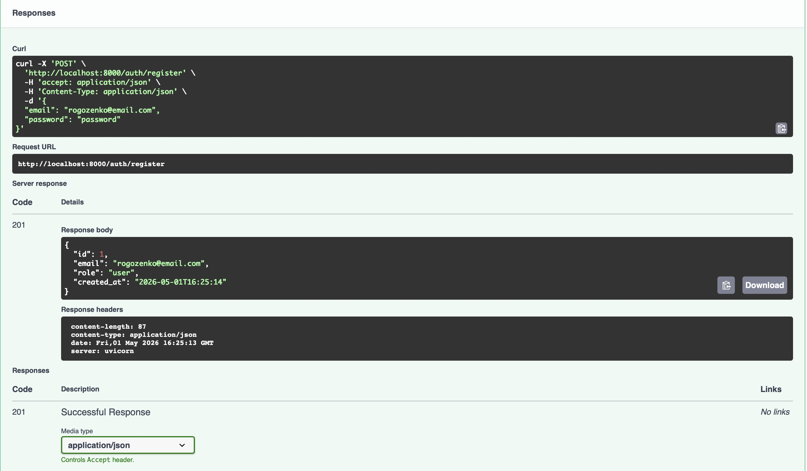
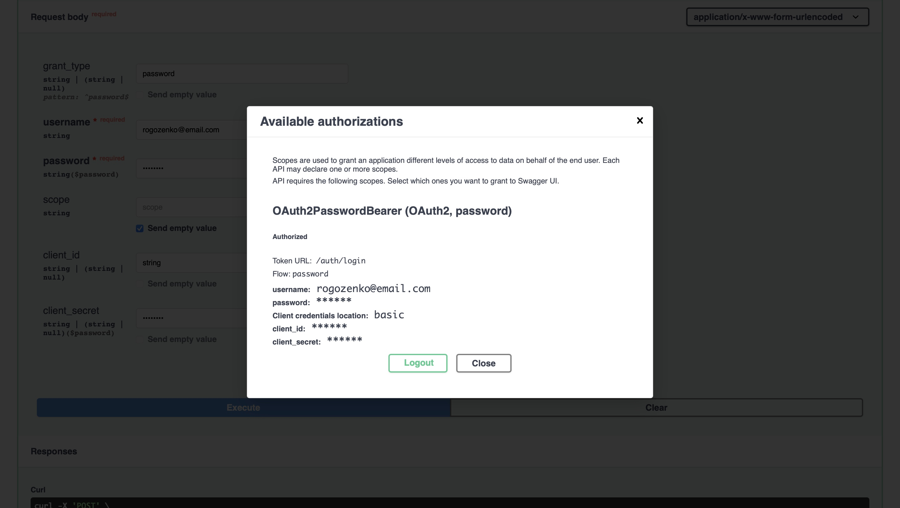
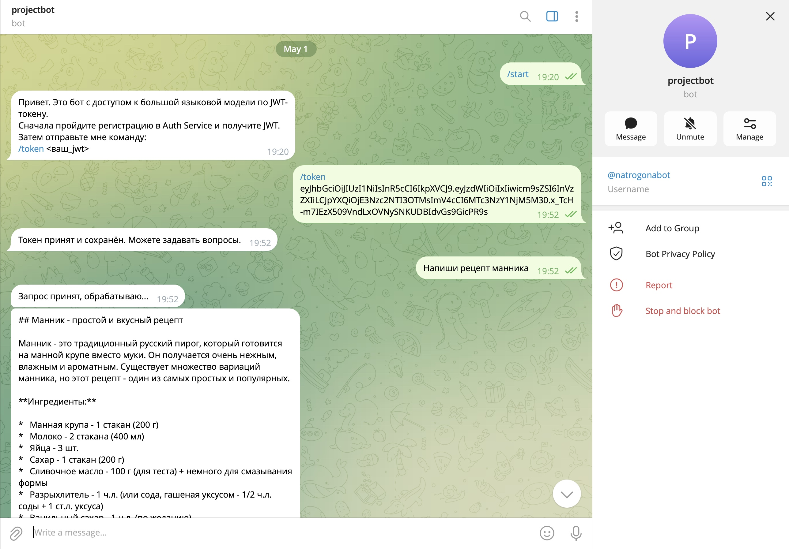
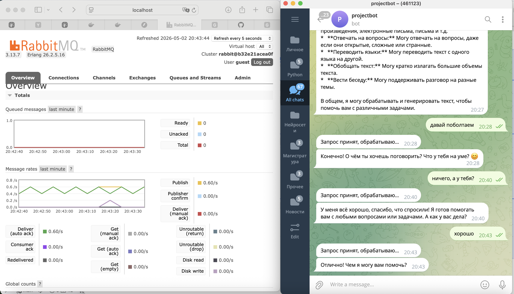
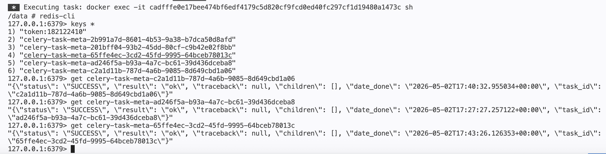
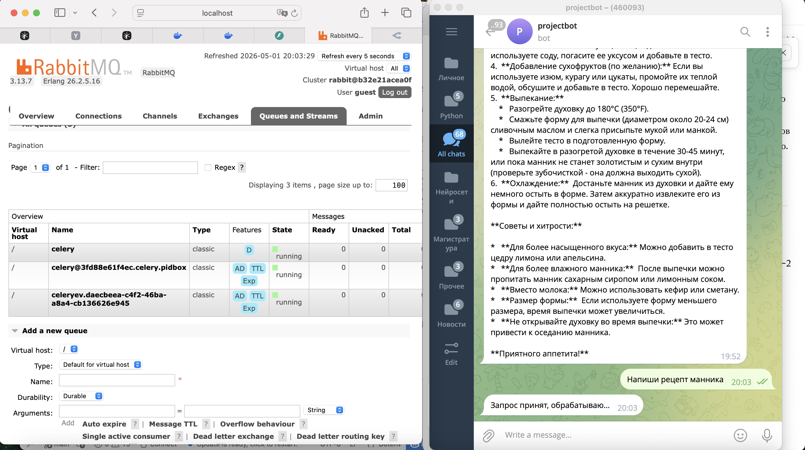
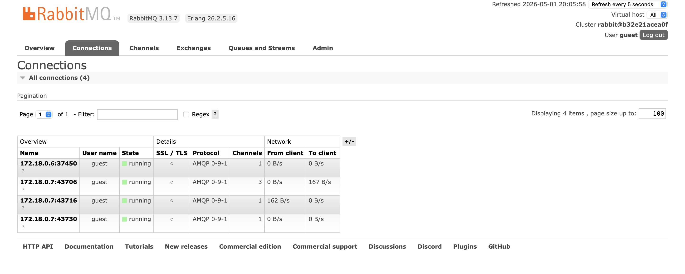
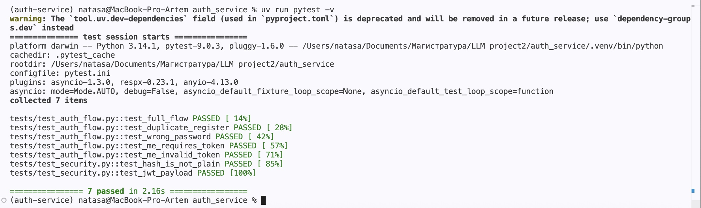
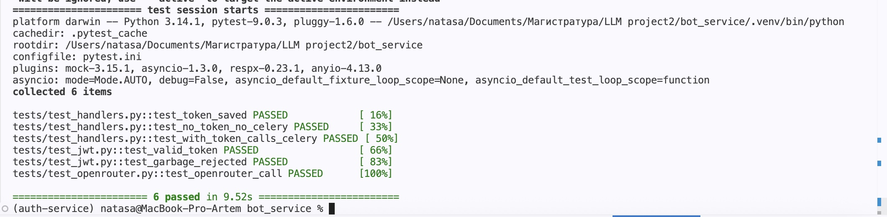

# Двухсервисная система LLM-консультаций

## Описание проекта
В рамках проекта разработана распределённая система, состоящая из двух независимых сервисов — Auth Service и Bot Service. Auth Service отвечает за регистрацию пользователей, аутентификацию и выпуск JWT-токенов. Bot Service предоставляет функциональность LLM-консультаций через тг-бота, доверяя только корректно подписанному и не истёкшему токену, выданному Auth Service.

Архитектура построена по принципу разделения ответственности: бот ничего не знает о пользователях и паролях, а сервис аутентификации не зависит от Telegram. Запросы к LLM не выполняются напрямую в обработчиках бота — задачи публикуются в очередь RabbitMQ и обрабатываются Celery-воркером, что обеспечивает отзывчивость бота и устойчивость системы к нагрузке. В качестве LLM-провайдера используется OpenRouter, в качестве хранилища пользовательских токенов и backend-результатов Celery — Redis.

Проект выполнила студентка НИЯУ МИФИ Рогозенко Наталья (номер зачетной книжки - М2551085).

## Сценарий
1. Пользователь регистрируется через Swagger Auth Service и получает JWT-токен.
2. Полученный токен в телеграме отправляет боту командой `/token <jwt>`.
3. Бот сохраняет токен в Redis и принимает обычные сообщения (текстовый запрос).
4. Каждое входящее сообщение проходит через валидацию JWT-токена, после чего публикуется в очередь RabbitMQ в виде задачи. Celery-воркер забирает задачу из очереди, обращается к OpenRouter за ответом LLM и отправляет результат обратно пользователю в Telegram.

## Скриншоты

### Скриншоты работы Swagger Auth Service:

#### Регистрация

#### Логин и получение токена

#### Авторизация

#### auth/me

### Скриншоты работы тг-бота:

#### Начало работы

#### Обработка запроса пользователя

### Скриншоты интерфейса RabbitMQ:

 - подтверждение использования Redis для бэкенда celery

### Скриншоты успешных тестов:

#### Auth-service

#### Bot-servie

